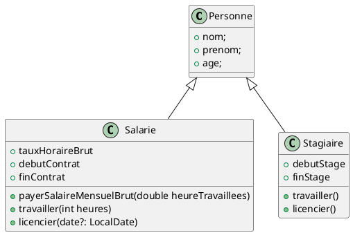

# Démonstration Héritage

## Description

Exemple d'utilisation de l'héritage avec des salariés et des stagiaires.

## Diagramme

```plantuml
@startuml

class Personne {
  +nom;
  +prenom;
  +age;
}

class Salarie extends Personne {
  +tauxHoraireBrut
  +debutContrat
  +finContrat
  +payerSalaireMensuelBrut(double heureTravaillees)
  +travailler(int heures)
  +licencier(date?: LocalDate)
}

class Stagiaire extends Personne {
  +debutStage
  +finStage
  +travailler()
  +licencier()
}

@enduml
```